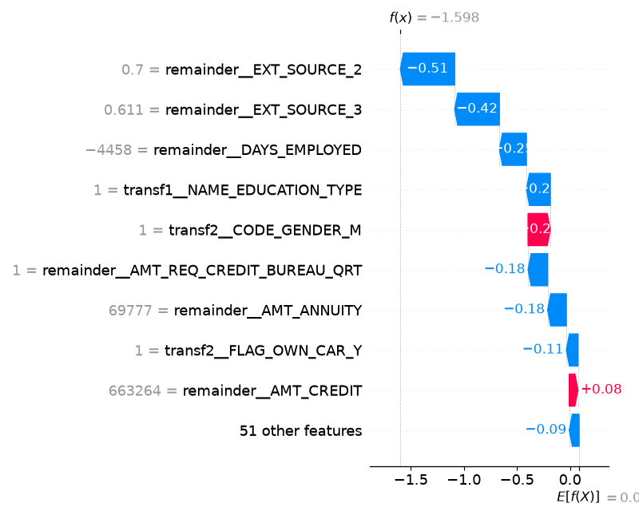

# Explainable Credit Underwriter

An end-to-end AI-powered credit underwriting platform that combines machine learning, explainable AI, and generative AI to automate credit risk assessment and produce audit-ready underwriting memos.

## Overview

Traditional credit scoring systems often act as black boxes. This project addresses that challenge by integrating:

- XGBoost for default risk prediction
- SHAP for customer-level explainability
- Generative AI for automated underwriting reports
- Streamlit for interactive decision support

---

## Architecture

Customer Financial Profile
↓
XGBoost Risk Model
↓
Default Probability
↓
SHAP Explainability Engine
↓
Top Risk Drivers
↓
LLM Credit Review Memo

---

## Features

### Credit Risk Modeling

- Home Credit Default Risk Dataset
- XGBoost Classifier
- ROC-AUC: 0.75
- Test Accuracy: 0.76

### Explainable AI

- Global SHAP Feature Importance
- SHAP Beeswarm Summary Plot
- Individual Applicant Waterfall Explanations

### GenAI Layer

Generates professional underwriting memos using:

- Applicant attributes
- Predicted risk score
- SHAP-derived risk drivers
- Feature descriptions

### Interactive Dashboard

- Real-time applicant evaluation
- Risk scoring
- Explainability visualization
- Automated decision memo generation

---

## Results

| Metric | Value |
|----------|----------|
| ROC-AUC | 0.75 |
| Test Accuracy | 0.76 |
| Positive Class Recall | 0.58 |
| Positive Class Precision | 0.18 |

---

## Sample Explainability

### Global Feature Importance

### SHAP Summary Plot

### Customer Waterfall Plot

### Customer Memo

CREDIT REVIEW MEMO

Risk Assessment:
The applicant presents a moderate default risk score of 16.83%. The primary risk drivers, including the gender metric and credit amount, contribute significantly to this assessment. However, the presence of positive external sources and a relatively long employment period mitigate these risks to some extent. Overall, the risk profile indicates a need for careful consideration.

Recommendation:
Approve. Despite the moderate risk score, the presence of mitigating factors suggests that the loan applicant is creditworthy, and the risk is considered manageable.
---

## Tech Stack

- Python
- Pandas
- NumPy
- XGBoost
- SHAP
- Scikit-Learn
- Streamlit
- Hugging Face Transformers
